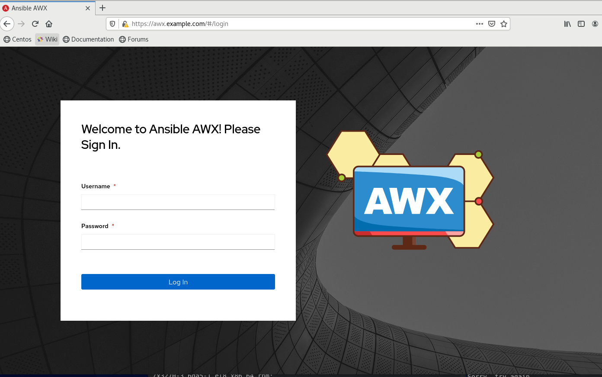

# Ansible AWX 설치 가이드

## 구성 요소 및 버전
awx-operator ([quay.io/awx-operator:0.8.0]())

awx ([quay.io/ansible/awx:18.0.0]())

awx-ee ([quay.io/ansible/awx-ee:0.1.1]())

redis ([redis:latest](https://hub.docker.com/layers/redis/library/redis/latest/images/sha256-b4b16c2978639e1423f3618732a75bb53967c6e3bf3722a3f8c31f9691743eea?context=explore))

postgres ([postgres:12](https://hub.docker.com/layers/postgres/library/postgres/12/images/sha256-328b452c593fa415c523ac54ec06a1170c4fccf170f41aa967ab159765c44f89?context=explore))


## 설치 가이드
### 1. awx operator deploy
[awx-operator.yaml](yamls/awx-operator.yaml)을 적용
```bash
kubectl apply -f awx-operator.yaml
```


### 2. awx deploy
[awx.yaml](yamls/awx.yaml)을 적용
```bash
kubectl apply -f awx.yaml
```

```
---
apiVersion: awx.ansible.com/v1beta1
kind: AWX
metadata:
  name: awx
spec:
  tower_ingress_type: Ingress
  tower_hostname: awx.example.com
  tower_image: quay.io/ansible/awx:18.0.0
  tower_ee_images:
    - name: awx-ee
      image: quay.io/ansible/awx-ee:0.1.1

```
`metadata-> name` :awx deployment에 사용할 이름

`tower_hostname`: awx 주소로 사용할 값

`tower_image`: awx 도커 이미지

`tower_ee_images`: awx_ee(execution environment) 도커 이미지


### 3. login
위에서 사용한 hostname으로 접속     
   
id: admin   
password: 아래 명령어를 쳐서 나오는 값을 패스워드로 사용   
```
kubectl get secret awx-admin-password -o jsonpath='{.data.password}' | base64 --decode
```


#### 기본 사용법 가이드
[AWX 기본 사용법 가이드](tutorial.md) 참고


#### Keycloak 연동
[keycloak 연동 가이드](keycloak.md) 참고


#### ssh-proxy 방법
[ssh-proxy 사용 가이드](ssh-proxy-guide.md) 참고
