# Keycloak 연동 가이드

### 1. Keycloak 연동
1. Cert 생성 및 등록
	- 사용할 certification이 없다면 아래 명령어를 통해 생성
	- ```$ openssl req -new -x509 -days 365 -nodes -out saml.crt -keyout saml.key ```
	- 생성한 saml.crt와 saml.key를 keycloak에 등록
	- keycloak admin page 로그인 후 Realm Settings -> keys -> Providers -> Add keystore -> rsa 진입   
	  
	  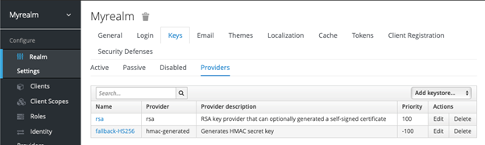
	- 이 때 기존에 존재하던 다른 provider들은 삭제   
	   
	  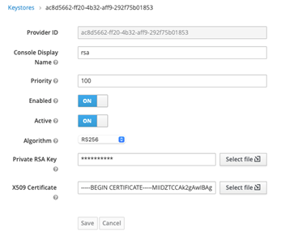
	- Private RSA Key에 saml.key를, X509 Certificate에 saml.crt를 등록
2. AWX SAML 설정
	- Settings -> SAML settings -> edit   
   
	  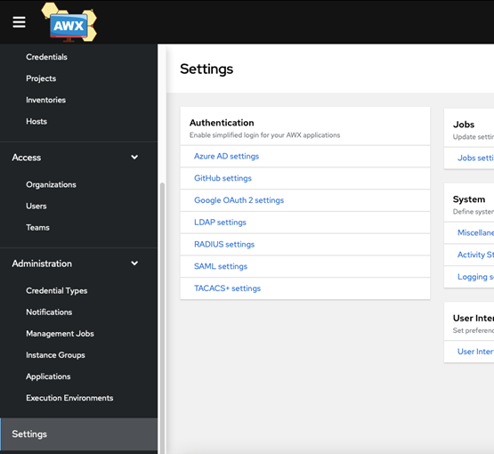
	- 다음 항목들을 사진을 참고하여 작성   
	    
		 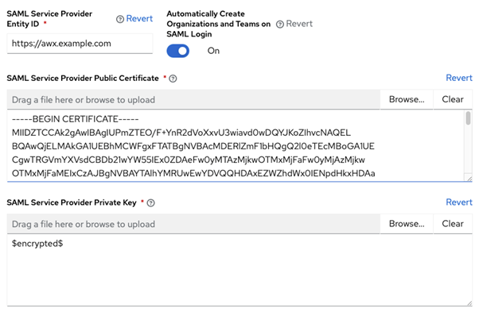
		- SAML Service Provider Entity ID : AWX의 url (keycloak에서 client로 관리할 id)
		- SAML Service Provider Public Certificate : saml.crt
		- SAML Service Provider Private Key : saml.key   
		   
		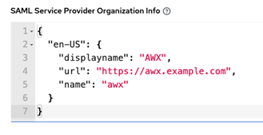
		- SAML Service Provider Organization Info : url은 AWX의 domain   
		   
		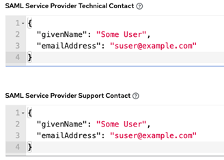   
		   
		- SAML Service Provider Support Contact   
		   
		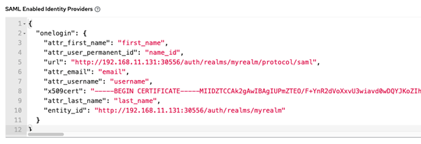
		- SAML Enabled Identity Providers: 로그인에 사용할 idP에 대한 정보 입력
			- "oneLogin" : idP의 이름
			- url과 entity_id의 url은 keycloack의 url 입력
			- x509cert에 saml.crt를 줄바꿈 없이 한줄로 입력  
3. Key cloak client 설정   
	- SAML 메타 데이터 저장   
	``` $ curl -L -k https://awx.example.com/sso/metadata/saml > tower_saml.xml ```
    - keycloak admin page 로그인 후 Clients -> Create -> import -> Select file 진입
    - Curl로 저장한 tower_saml.xml 파일 선택 및 다음 사진 참고하여 아래 설정들 변경
    	- Sign Assertitions -> On
    	- Encrypt Assertions -> OFF
    	- Client Signature Required -> OFF
    	- Root URL -> AWX url   
		   
        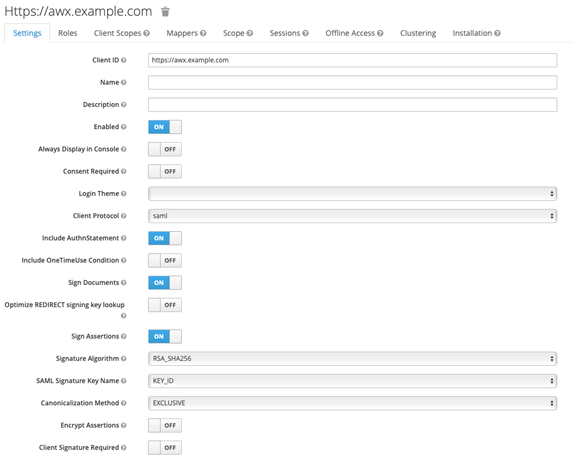   
		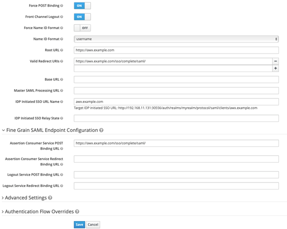   

        - 입력 완료 후 save
        - Clients -> Mappers -> Create
        - 다음과 같은 5개의 mapper 생성 (사진 참고)
		- username   
		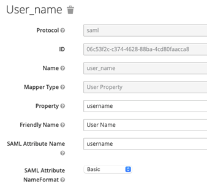
		- first name   
		 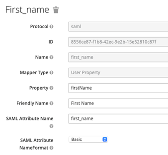
		- last name   
		 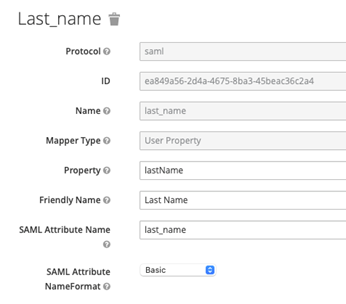
		- email   
		 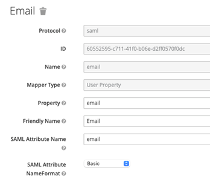
		- user_permanent id   
		 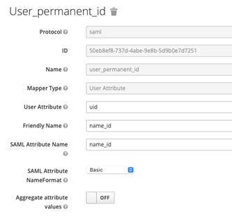
         
### 2. 로그인 확인   
- AWX에 접속하여 SSO 연동 및 로그인 확인    
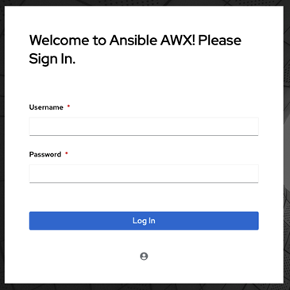
- Found an Attribute element with duplicated Name” 에러가 발생시,   
Keycloak admin page -> Client Scopes -> role_list -> Mappers -> role_list -> Single Role Attribute -> ON
