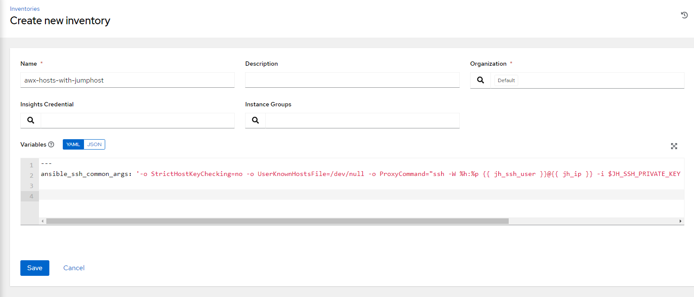
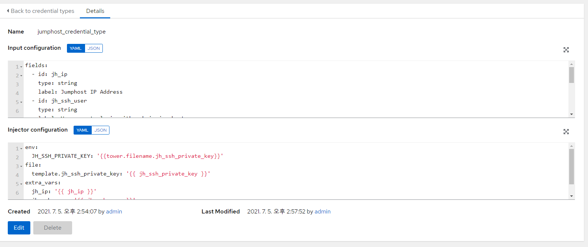
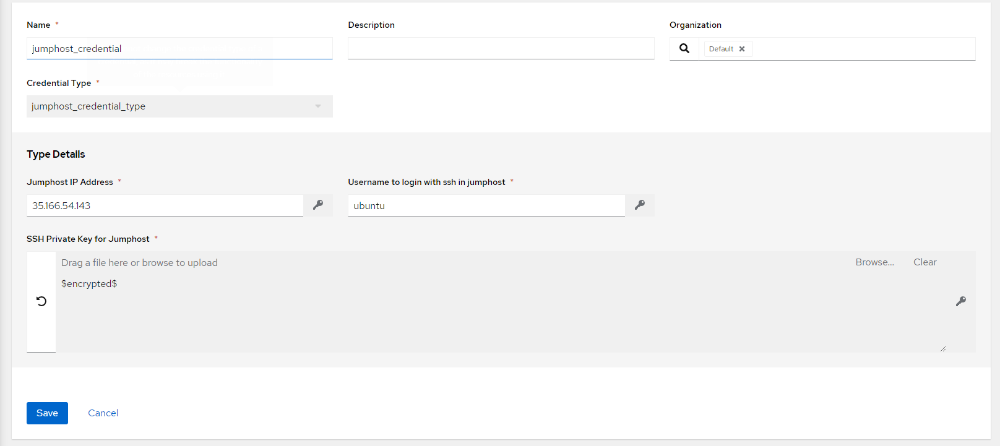
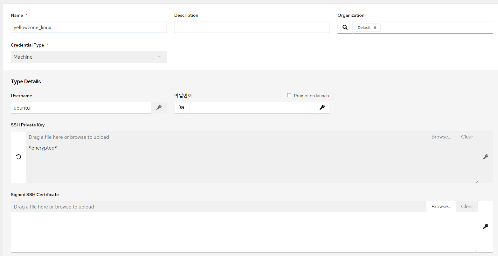
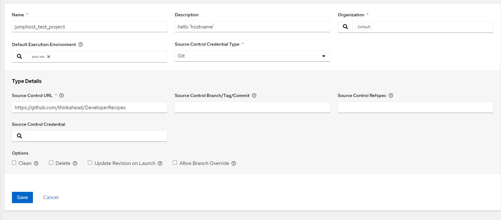
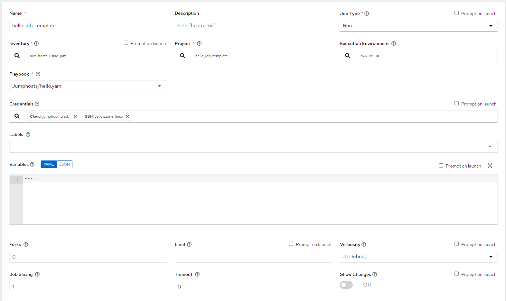

# SSH-Proxy 가이드
특정 host(jump host)를 통해서만 target hosts(yellow zone)에 접근할 수 있을 때
AWX에서 ssh-proxy를 설정하는 방법에 대한 가이드입니다.

### 1. 새로운 인벤토리 생성




- Variables에 다음 추가

```
ansible_ssh_common_args: '-o StrictHostKeyChecking=no -o UserKnownHostsFile=/dev/null -o ProxyCommand="ssh -W %h:%p {{ jh_ssh_user }}@{{ jh_ip }} -i $JH_SSH_PRIVATE_KEY -o StrictHostKeyChecking=no -o UserKnownHostsFile=/dev/null"'
```


### 2. Credential type 생성



- INPUT CONFIGURATION

```
fields:
  - id: jh_ip
    type: string
    label: Jumphost IP Address
  - id: jh_ssh_user
    type: string
    label: Username to login with ssh in jumphost
  - id: jh_ssh_private_key
    type: string
    label: SSH Private Key for Jumphost
    format: ssh_private_key
    secret: true
    multiline: true
required:
  - jh_ip
  - jh_ssh_user
  - jh_ssh_private_key

```

- INJECTOR CONFIGURATION
```
env:
  JH_SSH_PRIVATE_KEY: '{{tower.filename.jh_ssh_private_key}}'
file:
  template.jh_ssh_private_key: '{{ jh_ssh_private_key }}'
extra_vars:
  jh_ip: '{{ jh_ip }}'
  jh_ssh_user: '{{ jh_ssh_user }}'
```


### 3. Credential 생성
- 아래와 같이 jumphost, yellowzone에 대해 각각 credential 생성






### 4. 테스트
- 테스트용 프로젝트 생성 ([hello.yaml](https://github.com/thinkahead/DeveloperRecipes/blob/master/Jumphosts/hello.yaml), git 사용)



- 템플릿 생성
  - 1,3에서 만든 Inventory와 credential 사용
  

- 템플릿 실행 후 결과 확인
  