# AWX 기본 사용법 가이드
기본적인 AWX 사용 방법에 대한 가이드입니다.


## 1. 로그인
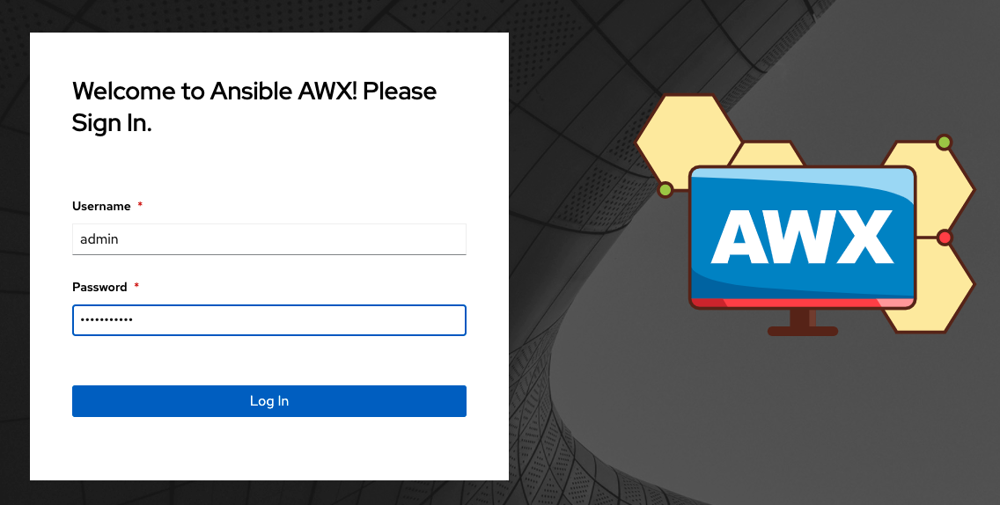

id: admin

password: secret에서 awx-admin-passsword의 값 확인 또는 아래 명령어

```bash
kubectl get secret awx-admin-password -o jsonpath='{.data.password}' | base64 --decode
```


## 2. Inventory 및 Host 등록
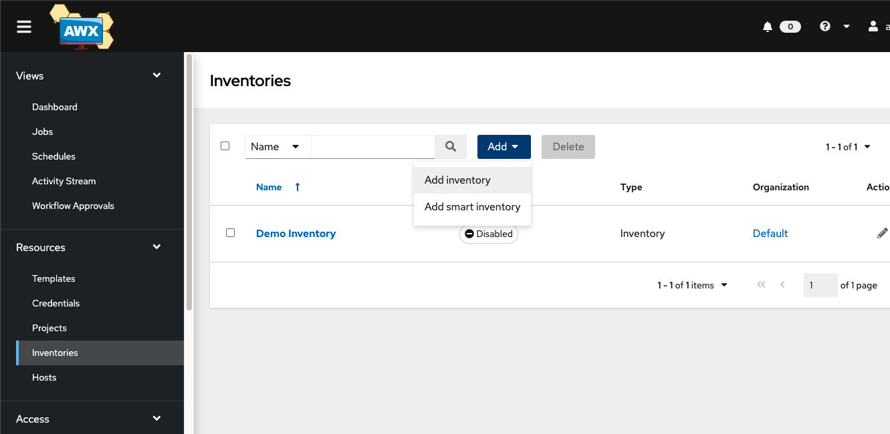

Inventories -> Add -> Add inventory


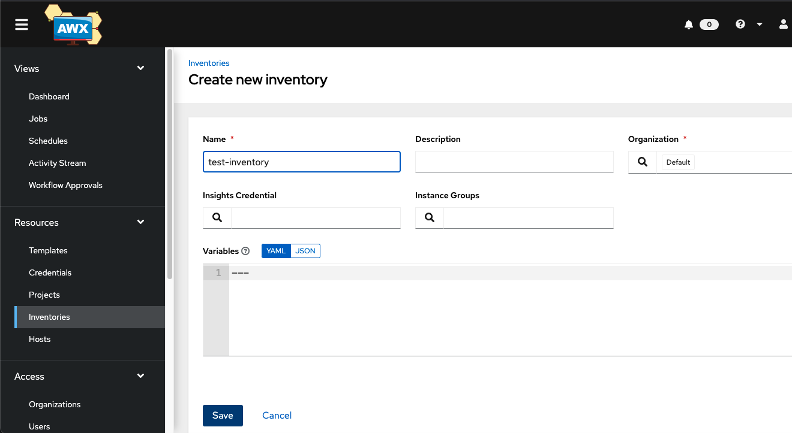

Name 입력 및 필요한 변수가 있다면 입력 후 저장


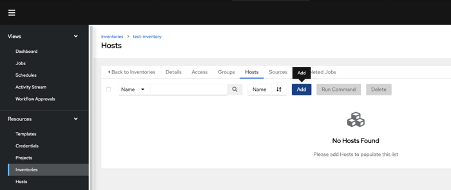

생성한 inventory에서 Hosts -> Add


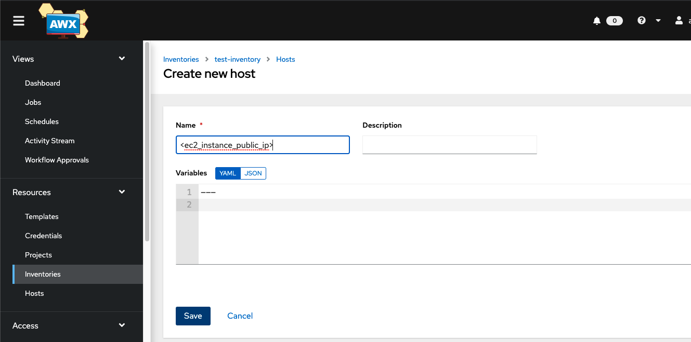

Name에 등록할 host 또는 host의 ip 입력


## 2. Credential 등록
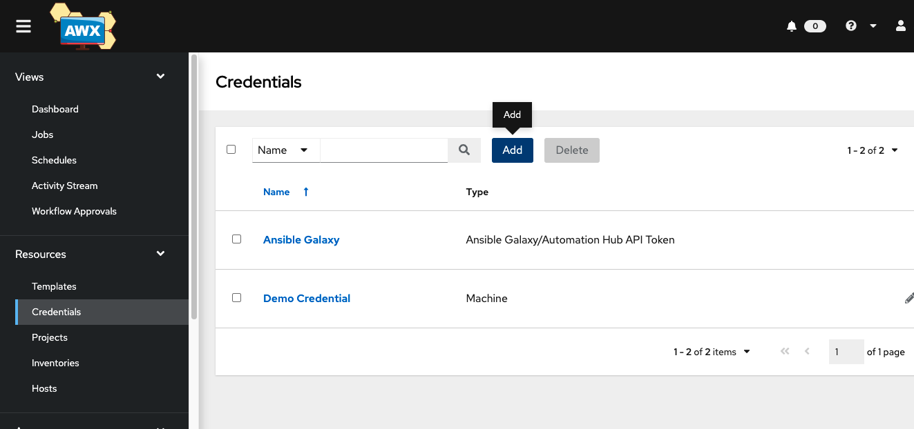

Credentials -> Add


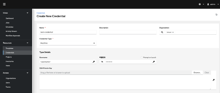

Name 입력 및 Credential Type -> Machine
Username, 비밀번호 입력 또는 SSH Private Key 업로드 후 저장


## 3. Project 등록
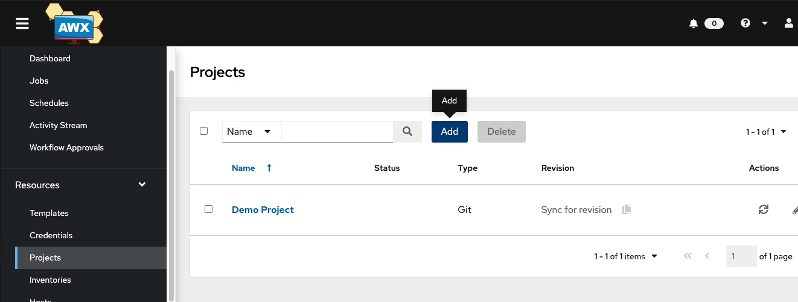

Projects -> Add


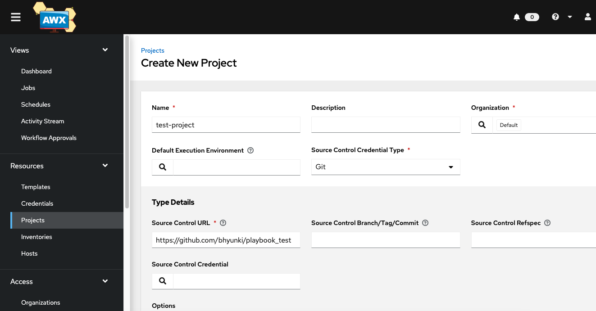

Name 입력 및 Source Control Credential Type -> Git
Source Control URL에 playbook 있는 git 주소 입력 후 저장


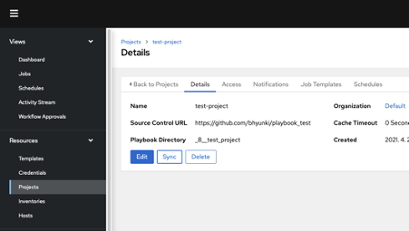

저장 후 sync


## 4. Template 등록 및 실행
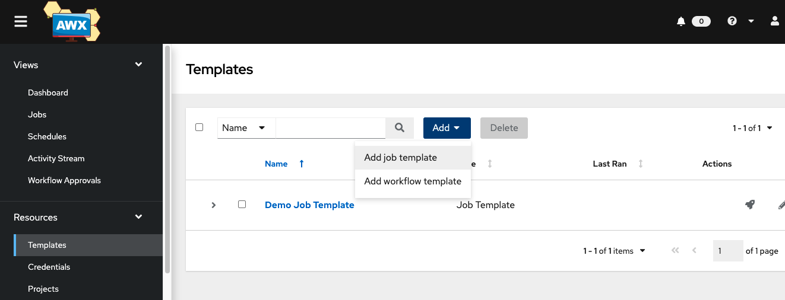

Templates -> Add -> Add job template


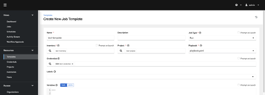

Name 입력, Inventory 및 Project 지정, playbook 선택, Credential 지정


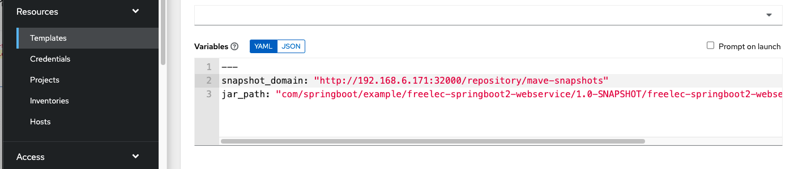

Variables로 필요한 변수 지정 및 저장


저장 후 Launch
